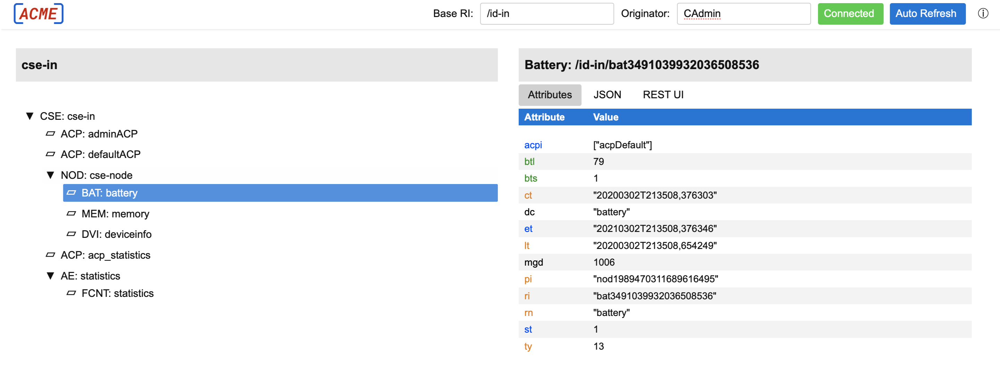

#  

# ACME oneM2M CSE
An open source CSE Middleware for Education.

Version 0.10.2

      

## Introduction

This CSE implements a subset of the oneM2M standard specializations (see [http://www.onem2m.org](http://www.onem2m.org)). The intention is to provide an easy to install, extensible, and easy to use and maintain CSE for educational purposes. Also see the discussion on [Limitations](docs/Supported.md#limitations).

## Documentation
Please consult the following pages for further instructions.

- [Installation](docs/Installation.md)
- [Configuration](docs/Configuration.md)
- [Running](docs/Running.md)
	- [Docker](docs/Docker.md)
	- [Notification Server](tools/notificationServer/README.md)
- [Web & Rest UI](docs/WebUI.md)
- [Importing Resources](docs/Importing.md)
- [Operation](docs/Operation.md)
- [ACMEScript](docs/ACMEScript.md)
	- [Commands](docs/ACMEScript-commands.md)
	- [Macros](docs/ACMEScript-macros.md)
	- [Meta Tags](docs/ACMEScript-metatags.md)
- [Supported Resource Types and Functionalities](docs/Supported.md)
	- [Limitations](docs/Supported.md#limitations)
- [Roadmap](docs/Roadmap.md)
- [Development](docs/Development.md)
- [Contributing](docs/Contributing.md)
- [FAQ](docs/FAQ.md)

## Changes

Please see the [Changelog](CHANGELOG.md) for the detailed list of changes.

### Important: Changed CSE bootstrapping
Before this release the initial resources to bootstrap the CSE were JSON scripts that were imported at the CSE's startup phase.
With this release this is changed to running the script *startup.as* that [imports the initial resources](docs/Importing.md#resources).

### Highlights in this release

- &lt;timeSyncBeacon> resource type support
- Guided setup process to create the initial configuration file
- Adapted announcements and time-series procedures to latest R4 changes
- Support for the Upper Tester interface defined in oneM2M's TS-0019
- Adding scripting support to the CSE that can be used through the console, the Upper Tester, CSE events and notifications, and other
- Improved the CSE console (e.g. drawing graph diagrams from &lt;contentInstance> resources, dark & light theme)
- Added support for BLOCKING UPDATE notification event type
- Improved announced resources (e.g. bi-directional update)
- Improved validation of complex attributes
- And, as usual, many improvements, bug fixes, and performance improvements

## Acknowledgements

Thank you for contributed code, patches, testing, bug fixes, time, and more!

 [Miguel Angel Reina Ortega](https://github.com/reinaortega)  
 [BobFIV](https://github.com/BobFIV)  
 [Yann Garcia](https://github.com/YannGarcia)  
 [Massimo Vanetti](https://github.com/massimov)  

## License
BSD 3-Clause License for the CSE and its native components and modules. Please see the individual licenses of the used third-party components.

