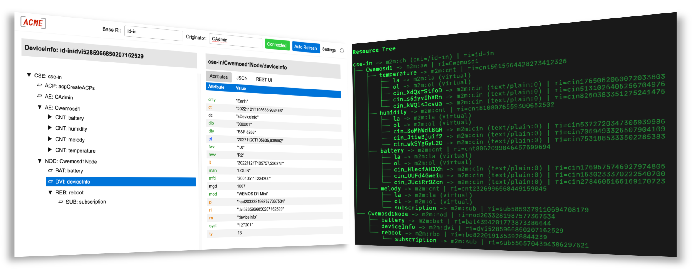

#  

# ACME oneM2M CSE
An open source CSE Middleware for Education.

Version 2023.10.1

      

## Introduction

This oneM2M compliant CSE implements a subset of the oneM2M standard (see [http://www.onem2m.org](http://www.onem2m.org)). The intention is to provide an easy to install, extensible, and easy to use and maintainable CSE for educational purposes.

## Documentation

- [Installation](docs/Installation.md)
- [Configuration](docs/Configuration.md)
- [Running](docs/Running.md)
	- [Console](docs/Console.md)
	- [Text UI](docs/TextUI.md)
	- [Docker](docs/Docker.md)
	- [Notification Server](tools/notificationServer/README.md)
    - [Web & Rest UI](docs/WebUI.md)
- [CSE Startup, Importing Resources and Other Settings](docs/Importing.md)
- [Operation](docs/Operation.md)
- [ACMEScript](docs/ACMEScript.md)
	- [Functions](docs/ACMEScript-functions.md)
	- [Meta Tags](docs/ACMEScript-metatags.md)
- [Supported Resource Types and Functionalities](docs/Supported.md)
	- [Limitations](docs/Supported.md#limitations)
- [Roadmap](docs/Roadmap.md)
- [Development](docs/Development.md)
- [Contributing](docs/Contributing.md)
	- [Acknowledgements](docs/Contributing.md#acknowledgements)
- [FAQ](docs/FAQ.md)

## Changes

Please see the [Changelog](CHANGELOG.md) and this [discussion](https://github.com/ankraft/ACME-oneM2M-CSE/discussions/120) for the detailed list of changes.

### Highlights in this release

- Support for the &lt;schedule> resource type.
- Limited support for the &lt;locationPolicy> resource type, and for the *location* attribute and *geo-queries*.
- Basic and bearer authorization for http requests.
- WSGI http server support. 

### Improvements
- Improved Text UI
  - Added an input field for passing script arguments to tool scripts
  - Added diagrams for &lt;containers> that have &lt;contentInstances> with numeric values.
- Improved scripting support with new functions and better script organization.
- Improved on-boarding by offering automatic installation of missing Python packages

### Breaking Changes
- Python 3.8 will be EOL soon. To move forward, from this release on ACME will require Python 3.10 or greater. 

### What to expect in the next release

See the [announcement](https://github.com/ankraft/ACME-oneM2M-CSE/discussions/129) in the [discussions](https://github.com/ankraft/ACME-oneM2M-CSE/discussions).

## Acknowledgements

Many People have contributed to this project and helped to make it what it is today with their ideas, suggestions, and code. Please see the [Acknowledgements](docs/Contributing.md#acknowledgements) for the list of contributors.

## License

BSD 3-Clause License for the CSE and its native components and modules. Please see the individual licenses of the used third-party components.

