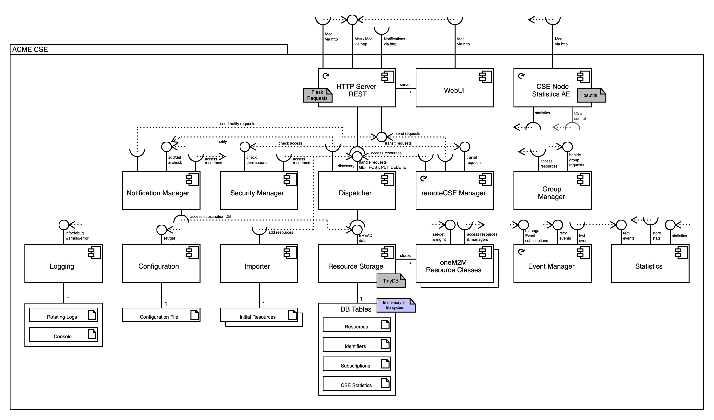
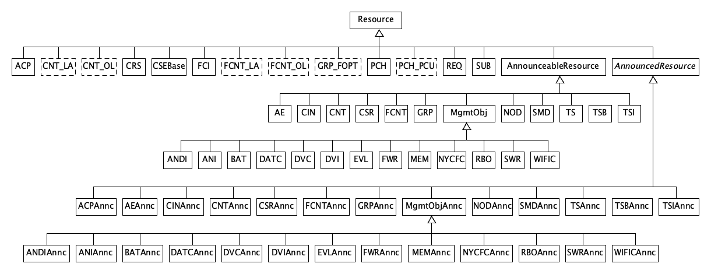

[← README](../README.md) 
# Development

[The Messy Details](#messy_details)  
[Resource Class Hierarchy](#classes)  
[Integration Into Other Applications](#integration)  
[Running Test Cases](#test_cases)  
[MyPy Static Type Checker](#mypy)  
[Debug Mode](#debug-mode)  


<a name="messy_details"></a>
## The Messy Details

### Components



<a name="classes"></a>
### Resource Class Hierarchy



<a name="integration"></a>
## Integration Into Other Applications

It is possible to integrate the CSE into other applications, e.g. a Jupyter Notebook. In this case you would possibly like to provide startup arguments, for example the path of the configuration file or the logging level, directly instead of getting them from *argparse*.

You might want to get the example from the starter file [acme.py](acme.py) where you could replace the line:

```python
CSE.startup(parseArgs())
```

with a call to the CSE's *startup()* function:

```python
CSE.startup(None, configfile=defaultConfigFile, loglevel='error')
```

Please note that in case you provide the arguments directly the first argument needs to be `None`. 

The names of the *argparse* variables can be used here, and you may provide all or only some of the arguments. Please note that you need to keep or copy the `import` and `sys.path` statements at the top of that file.


<a name="test_cases"></a>
## Running Test Cases

Various aspects of the ACME implementation are covered by unit tests based on the Python [unittest](https://docs.python.org/3/library/unittest.html) framework. The files for test cases and the runner application reside in the [tests](../tests) directory.


### Configuration & Running
Each test suite imports the file [init.py](../tests/init.py) that contains various helper functions used by the test suites. 

The actual configuration of the test suite is done in the file [config.py](../tests/config.py). You may change these for your individual set-up. In this file there is also a configuration setting for the request protocol that should be used. Currently, *http*, *https*, and *mqtt* are supported. Please note, that all CSE's involved in the test runs must use the same protocol type.

One can also provide OAuth2 settings in case the CSE under test is behind an OAuth2 gateway.

#### Enable Remote Configuration

The CSE under test must be started with the **remote configuration interface** enabled. During test runs the test suite will temporarily change some of the CSE's delays (e.g. the check for resource expirations) in order to speed up the test. You can either do this by changing the configuration [enableRemoteConfiguration](Configuration.md#server_http) in the [configuration file](../acme.ini.default), or by providing the [--remote-configuration](Running.md) command line argument during startup.

### Test Suites

For each aspect of the CSE there is one test suite file that can be run independently or in the course of an overall test. For example, running the test suite for AE tests would look like this:

	$ python3 testAE.py
	test_createAE (__main__.TestAE) ... ok
	test_createAEUnderAE (__main__.TestAE) ... ok
	test_retrieveAE (__main__.TestAE) ... ok
	test_retrieveAEWithWrongOriginator (__main__.TestAE) ... ok
	test_attributesAE (__main__.TestAE) ... ok
	test_updateAELbl (__main__.TestAE) ... ok
	test_updateAETy (__main__.TestAE) ... ok
	test_updateAEPi (__main__.TestAE) ... ok
	test_updateAEUnknownAttribute (__main__.TestAE) ... ok
	test_retrieveAEACP (__main__.TestAE) ... ok
	test_deleteAEByUnknownOriginator (__main__.TestAE) ... ok
	test_deleteAEByAssignedOriginator (__main__.TestAE) ... ok
	----------------------------------------------------------------------
	Ran 12 tests in 0.116s
	OK

### Test Runner

The Python script [runTests.py](../tests/runTests.py) can be used to run all test suites. It looks for all Python scripts starting with *test..." and runs them in alphabetical order. At the end of a full test run it also provides a nice summary of the test results:

	$ python3 runTests.py

	...

										[ACME] - Test Results
	┏━━━━━━━━━━━━━━━━━┳━━━━━━━┳━━━━━━━━━┳━━━━━━━━┳━━━━━━━━━━━┳━━━━━━━━━━━━━━┳━━━━━━━━━━━━━┳━━━━━━━━━━┓
	┃ Test Suite      ┃ Count ┃ Skipped ┃ Errors ┃ Exec Time ┃ Process Time ┃ Time / Test ┃ Requests ┃
	┡━━━━━━━━━━━━━━━━━╇━━━━━━━╇━━━━━━━━━╇━━━━━━━━╇━━━━━━━━━━━╇━━━━━━━━━━━━━━╇━━━━━━━━━━━━━╇━━━━━━━━━━┩
	│ testACP         │    38 │       0 │      0 │    0.5053 │       0.1704 │      0.0133 │       41 │
	│ testAE          │    22 │       0 │      0 │    0.3102 │       0.1208 │      0.0141 │       29 │
	│ testAddressing  │     6 │       0 │      0 │    0.1233 │       0.0491 │      0.0206 │       12 │
	│ testCIN         │    15 │       0 │      0 │    0.2898 │       0.1059 │      0.0193 │       25 │
	│ testCNT         │    21 │       0 │      0 │    0.3538 │       0.1121 │      0.0168 │       26 │
	│ testCNT_CIN     │    21 │       0 │      0 │    1.3948 │       0.3084 │      0.0664 │       67 │
	│ testCSE         │     7 │       0 │      0 │    0.0568 │       0.0323 │      0.0081 │        7 │
	│ testDiscovery   │    52 │       0 │      0 │    1.2863 │       0.3321 │      0.0247 │       78 │
	│ testExpiration  │     8 │       0 │      0 │   30.8556 │       0.2335 │      3.8569 │       57 │
	│ testFCNT        │    22 │       0 │      0 │    0.3395 │       0.1082 │      0.0154 │       26 │
	│ testFCNT_FCI    │    10 │       0 │      0 │    0.2885 │       0.0868 │      0.0289 │       22 │
	│ testGRP         │    19 │       0 │      0 │    0.7213 │       0.1692 │      0.0380 │       42 │
	│ testMgmtObj     │    56 │       0 │      0 │    0.6410 │       0.2493 │      0.0114 │       58 │
	│ testMisc        │    13 │       0 │      0 │    0.0888 │       0.0510 │      0.0068 │       13 │
	│ testNOD         │    12 │       0 │      0 │    0.2500 │       0.1028 │      0.0208 │       25 │
	│ testPCH         │    11 │       0 │      0 │    0.1883 │       0.0697 │      0.0171 │       17 │
	│ testPCH_PCU     │    10 │       0 │      0 │   24.3880 │       0.1652 │      2.4388 │       32 │
	│ testREQ         │    24 │       0 │      0 │   37.7911 │       0.2304 │      1.5746 │       52 │
	│ testRemote      │     7 │       0 │      0 │    0.1350 │       0.0549 │      0.0193 │       14 │
	│ testRemote_Annc │    29 │       0 │      0 │    0.6955 │       0.1958 │      0.0240 │       49 │
	│ testRequests    │    12 │       0 │      0 │   10.1306 │       0.0634 │      0.8442 │       14 │
	│ testSUB         │    62 │       0 │      0 │   10.2884 │       0.4505 │      0.1659 │      102 │
	│ testTS          │    19 │       0 │      0 │    0.3104 │       0.0870 │      0.0163 │       21 │
	│ testTS_TSI      │    33 │       0 │      0 │  105.4688 │       0.4602 │      3.1960 │      107 │
	├─────────────────┼───────┼─────────┼────────┼───────────┼──────────────┼─────────────┼──────────┤
	│ Totals          │   529 │       0 │      0 │  226.9253 │       4.0327 │      0.4290 │      936 │
	└─────────────────┴───────┴─────────┴────────┴───────────┴──────────────┴─────────────┴──────────┘

The ```runTest.py``` script by default will run all test cases, except scripts that runs load tests. To include those one need to specify the ```--load-include``` command line argument.

One can also specify which test cases to run like this:

	$ python3 runTests.py testACP testCin

The ```--help``` command line argument provides a usage overview for the ```runTest.py``` script.


### Dependencies
Each test suite may set-up resources in the CSE that are used during the tests. Usually, those resources should be removed from the CSE at the end of each test suite, but under certain circumstances (like a crash or forceful interruption of the test suite's run) those resources may still be present in the CSE and must be removed manually (or by a reset-restart of the CSE).

Some test cases in each test suite build on each other (such as adding a resource that is updated by further test cases). This means that the order of the test cases in each test suite is important. The test suites, however, can work independent from each other.

Some test suites (for example *testRemote*) need in addition to a running IN- or MN-CSE another MN-CSE that registers to the "main" CSE in order to run registration and announcement tests.


<a name="mypy"></a>
## MyPy Static Type Checker

The CSE code is statically type-checked with [mypy](http://mypy-lang.org). 

Just execute the ```mypy``` command in the project's root directory. It will read its configuration from the configuration file [mypy.ini](../mypy.ini).


## Debug Mode

The CSE tries to catch errors and give helpful advice as much as possible during runtime.
However, there are circumstances when this could not done easily, e.g. during startup.

In order to provide additional information in these situations one can set the *ACME_DEBUG* environment (to any value):

	$ export ACME_DEBUG=1

[← README](../README.md) 