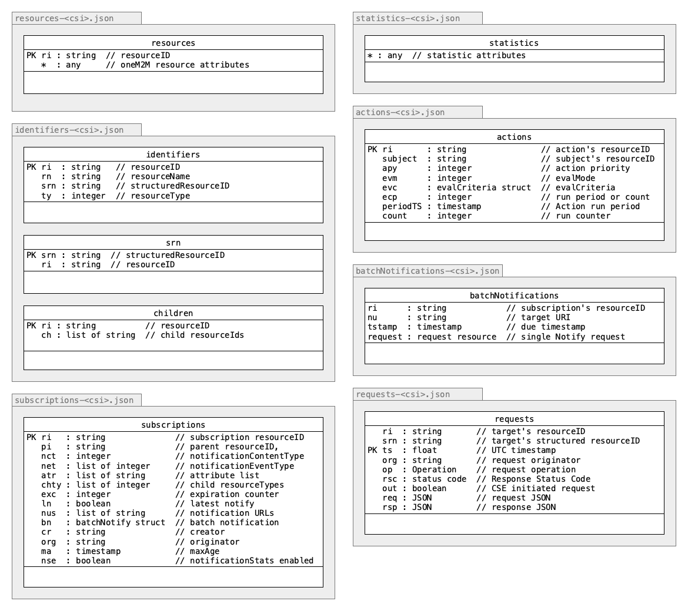

[← README](../README.md) 
# Development

[The Messy Details](#messy_details)  
[Resource Class Hierarchy](#classes)  
[Integration Into Other Applications](#integration)  
[Unit Tests](#unit_tests)  
[MyPy Static Type Checker](#mypy)  
[Debug Mode](#debug-mode)  


<a name="messy_details"></a>
## The Messy Details

### Components


<a name="classes"></a>
### Resource Class Hierarchy


### Database Schemas



If not hold in memory the database files are stored in the ["data"](../data) sub-directory. 

The database used by the CSE is [TinyDB](https://github.com/msiemens/tinydb) which uses plain JSON files for storing the data. Some files only contain a single data table while other contain multiple tables.

The filenames include the *CSE-ID* of the running CSE, so if multiple CSEs are running and are using the same data directory then they won't interfere with each other. The database files are copied to a *backup* directory at CSE startup.

Some database tables duplicate attributes from actual resources, e.g. in the *subscription* database. This is mainly done for optimization reasons in order to prevent a retrieval and instantiation of a full resource when only a few attributes are needed.


<a name="integration"></a>
## Integration Into Other Applications

It is possible to integrate the CSE into other applications. In this case you would possibly like to provide startup arguments, for example the path of the configuration file or the logging level, directly instead of getting them from *argparse*.

You might want to get the example from the starter file [acme.py](acme.py) where you could replace the line:

```python
CSE.startup(parseArgs())
```

with a call to the CSE's *startup()* function:

```python
CSE.startup(None, configfile=defaultConfigFile, loglevel='error')
```

Please note that in case you provide the arguments directly the first argument needs to be `None`. 

The names of the *argparse* variables can be used here, and you may provide all or only some of the arguments. Please note that you need to keep or copy the `import` and `sys.path` statements at the top of that file.

### Jupyter Notebooks

Since ACME CSE is written in pure Python it can be run in a Jupyter Notebook. The following code could be copied to a notebook to run the CSE.

```python
# Increase the width of the notebook to accommodate the log output
from IPython.display import display, HTML
display(HTML("<style>.container { width:100% !important; }</style>"))

# Change to the CSE's directory and start the CSE
# Ignore the error from the %cd command
%cd -q tools/ACME   # adopt this to the location of the ACME CSE
%run -m acme -- --headless
```

- The CSE should be run in *headless* mode to avoid too much output to the notebook.
- Once executed the notebook cell will not finish its execution. It is therefore recommended to run the CSE in a separate notebook.
- The CSE can only be stopped by stopping or restarting the notebook's Python kernel.

<a name="unit_tests"></a>

## Unit Tests

Various aspects of the ACME implementation are covered by unit tests based on the Python [unittest](https://docs.python.org/3/library/unittest.html) framework. The files for the individual test suites and the runner application reside in the [tests](../tests) directory.


### Configuration
The actual configuration of the test suite is done in the file [config.py](../tests/config.py). You may change these for your individual set-up. At the top of the configuartion there is  a configuration setting for the request protocol that should be used. Currently, *http*, *https*, and *mqtt* are supported. Please note, that all CSE's involved in the tests must use the same protocol type.

Further configuration settings include the originatores for admin access, self-registration, and remote CSE settings when running tests for CSE-2-CSE communications, 

One can also provide OAuth2 settings in case the CSE under test is behind an OAuth2 gateway.

#### Enable Remote Configuration (Upper Tester)

The CSE under test must be started with the **remote configuration interface** enabled. During test runs the test suite will temporarily change some of the CSE's delays (e.g. the check for resource expirations) in order to speed up the test. You can either do this by changing the configuration [http.enableUpperTesterEndpoint](Configuration.md#server_http) in the [configuration file](../acme.ini.default).

> **Note**
>
> This ability to remotly re-configure the CSE during runtime is a particular function of the  *ACME* CSE and might not be available with other CSE implementations.

#### Internal Settings

Each test suite imports the file [init.py](../tests/init.py) that contains various helper functions. Also some low-level configurations, such as time-outs etc, that are used by the test suites can be adjusted here. 

### Unit Tests

For each aspect of the CSE there is one test suite file that can be run independently or in the course of an overall test. For example, running the test suite for AE tests would look like this:

	$ python3 testAE.py
	test_createAE (__main__.TestAE) ... ok
	test_createAEUnderAE (__main__.TestAE) ... ok
	test_retrieveAE (__main__.TestAE) ... ok
	test_retrieveAEWithWrongOriginator (__main__.TestAE) ... ok
	test_attributesAE (__main__.TestAE) ... ok
	test_updateAELbl (__main__.TestAE) ... ok
	test_updateAETy (__main__.TestAE) ... ok
	test_updateAEPi (__main__.TestAE) ... ok
	test_updateAEUnknownAttribute (__main__.TestAE) ... ok
	test_retrieveAEACP (__main__.TestAE) ... ok
	test_deleteAEByUnknownOriginator (__main__.TestAE) ... ok
	test_deleteAEByAssignedOriginator (__main__.TestAE) ... ok
	----------------------------------------------------------------------
	Ran 12 tests in 0.116s
	OK

### Test Runner

#### Overview

The ```--help``` command line argument provides a usage overview for the ```runTest.py``` script.

```
$ python runTests.py -h

usage: runTests.py [-h] [--all] [--load-only] [--verbose-requests] [--disable-teardown] [--run-teardown]
                   [--run-count NUMBEROFRUNS] [--run-tests TESTCASENAME [TESTCASENAME ...]] [--show-skipped]
                   [--no-failfast] [--list-tests | --list-tests-sorted]
                   [TESTSUITE ...]

positional arguments:
  TESTSUITE             specific test suites to run. Run all test suites if empty

options:
  -h, --help            show this help message and exit
  --all                 run all test suites (including load tests)
  --load-only           run only load test suites
  --verbose-requests, -v
                        show verbose requests, responses and notifications output
  --disable-teardown, -notd
                        disable the tear-down / cleanup procedure at the end of a test suite
  --run-teardown, -runtd
                        run the specified test cases' tear-down functions and exit
  --run-count NUMBEROFRUNS
                        run each test suite n times (default: 1)
  --run-tests TESTCASENAME [TESTCASENAME ...], -run TESTCASENAME [TESTCASENAME ...]
                        run only the specified test cases from the set of test suites
  --show-skipped        show skipped test cases in summary
  --no-failfast         continue running test cases after a failure
  --list-tests, -ls     list the test cases of the specified test suites in the order they are defined and
                        exit
  --list-tests-sorted, -lss
                        alphabetical sorted list the test cases of the specified test suites and exit
```

#### Running the Tests

The Python script [runTests.py](../tests/runTests.py) can be used to run all test suites. It looks for all Python scripts starting with *test..." and runs them in alphabetical order. At the end of a full test run it also provides a  summary of the test results, including time spend for requests, as a process etc.

Usually, the test suites are run only once, but one can specify the *--run-count* option to execute tests multiple times.

	$ python3 runTests.py
	
	...
	
														[ACME] - Test Results
	┏━━━━━━━━━━━━━━━━━━━━━┳━━━━━━━┳━━━━━━━━━┳━━━━━━━━┳━━━━━━━━━━━━━━━━━━━━━━━━━━━━━━┳━━━━━━━━━━━━━━━━━━━┳━━━━━━━━━━━━━━━━━━━┳━━━━━━━━━━┓
	┃                     ┃       ┃         ┃        ┃            Times             ┃   Exec Time per   ┃   Proc Time per   ┃          ┃
	┃ Test Suite          ┃ Count ┃ Skipped ┃ Errors ┃     Exec | Sleep | Proc      ┃  Test | Request   ┃  Test | Request   ┃ Requests ┃
	┡━━━━━━━━━━━━━━━━━━━━━╇━━━━━━━╇━━━━━━━━━╇━━━━━━━━╇━━━━━━━━━━━━━━━━━━━━━━━━━━━━━━╇━━━━━━━━━━━━━━━━━━━╇━━━━━━━━━━━━━━━━━━━╇━━━━━━━━━━┩
	│ testACP             │    42 │       0 │      0 │   0.5873 |   0.00 |   0.1181 │  0.0140 |  0.0109 │  0.0028 |  0.0022 │       54 │
	│ testACTR            │     3 │       0 │      0 │   0.0478 |   0.00 |   0.0127 │  0.0159 |  0.0080 │  0.0042 |  0.0021 │        6 │
	│ testAE              │    25 │       0 │      0 │   0.4417 |   0.00 |   0.0735 │  0.0177 |  0.0134 │  0.0029 |  0.0022 │       33 │
	│ testAddressing      │     8 │       0 │      0 │   0.1895 |   0.00 |   0.0308 │  0.0237 |  0.0135 │  0.0039 |  0.0022 │       14 │
	│ testCIN             │    17 │       0 │      0 │   0.3655 |   0.00 |   0.0585 │  0.0215 |  0.0131 │  0.0034 |  0.0021 │       28 │
	│ testCNT             │    21 │       0 │      0 │   0.4119 |   0.00 |   0.0706 │  0.0196 |  0.0158 │  0.0034 |  0.0027 │       26 │
	│ testCNT_CIN         │    26 │       0 │      0 │   4.9397 |   4.00 |   0.2228 │  0.1900 |  0.0610 │  0.0086 |  0.0028 │       81 │
	│ testCRS             │    62 │       0 │      0 │  84.0746 |  81.80 |   0.5280 │  1.3560 |  0.6369 │  0.0085 |  0.0040 │      132 │
	│ testCSE             │     8 │       0 │      0 │   0.1862 |   0.00 |   0.0503 │  0.0233 |  0.0233 │  0.0063 |  0.0063 │        8 │
	│ testDiscovery       │    54 │       0 │      0 │   1.0766 |   0.00 |   0.1789 │  0.0199 |  0.0135 │  0.0033 |  0.0022 │       80 │
	│ testExpiration      │     8 │       0 │      0 │  30.7233 |  30.00 |   0.1932 │  3.8404 |  0.7145 │  0.0242 |  0.0045 │       43 │
	│ testFCNT            │    23 │       0 │      0 │   0.4121 |   0.00 |   0.0804 │  0.0179 |  0.0153 │  0.0035 |  0.0030 │       27 │
	│ testFCNT_FCI        │    11 │       0 │      0 │   0.2775 |   0.00 |   0.0425 │  0.0252 |  0.0116 │  0.0039 |  0.0018 │       24 │
	│ testGRP             │    28 │       0 │      0 │   0.7579 |   0.00 |   0.1099 │  0.0271 |  0.0138 │  0.0039 |  0.0020 │       55 │
	│ testMgmtObj         │    80 │       0 │      0 │   1.0088 |   0.00 |   0.1998 │  0.0126 |  0.0123 │  0.0025 |  0.0024 │       82 │
	│ testMisc            │    18 │       0 │      0 │   4.4119 |   4.00 |   0.1615 │  0.2451 |  0.1765 │  0.0090 |  0.0065 │       25 │
	│ testNOD             │    12 │       0 │      0 │   0.3239 |   0.00 |   0.0770 │  0.0270 |  0.0130 │  0.0064 |  0.0031 │       25 │
	│ testPCH             │    13 │       0 │      0 │   0.1699 |   0.00 |   0.0395 │  0.0131 |  0.0089 │  0.0030 |  0.0021 │       19 │
	│ testPCH_PCU         │    11 │       0 │      0 │  30.8078 |  15.00 |   0.3497 │  2.8007 |  0.7514 │  0.0318 |  0.0085 │       41 │
	│ testREQ             │    25 │       0 │      0 │  46.5237 |  45.00 |   0.5464 │  1.8609 |  1.1347 │  0.0219 |  0.0133 │       41 │
	│ testRemote          │     7 │       0 │      0 │   0.2121 |   0.00 |   0.0533 │  0.0303 |  0.0151 │  0.0076 |  0.0038 │       14 │
	│ testRemote_Annc     │    37 │       0 │      0 │   0.7482 |   0.00 |   0.1244 │  0.0202 |  0.0125 │  0.0034 |  0.0021 │       60 │
	│ testRemote_GRP      │     2 │       0 │      0 │   0.0659 |   0.00 |   0.0113 │  0.0330 |  0.0132 │  0.0056 |  0.0023 │        5 │
	│ testRemote_Requests │     2 │       0 │      0 │   0.0677 |   0.00 |   0.0119 │  0.0339 |  0.0135 │  0.0060 |  0.0024 │        5 │
	│ testRequests        │    12 │       0 │      0 │  10.3716 |   0.00 |   0.1257 │  0.8643 |  0.7408 │  0.0105 |  0.0090 │       14 │
	│ testSMD             │    14 │       0 │      0 │   0.2395 |   0.00 |   0.0587 │  0.0171 |  0.0133 │  0.0042 |  0.0033 │       18 │
	│ testSUB             │    81 │       0 │      0 │  16.9685 |  15.00 |   0.4738 │  0.2095 |  0.1266 │  0.0058 |  0.0035 │      134 │
	│ testTS              │    33 │       0 │      0 │   0.5149 |   0.00 |   0.1064 │  0.0156 |  0.0135 │  0.0032 |  0.0028 │       38 │
	│ testTSB             │     7 │       0 │      0 │   6.2509 |   6.00 |   0.1507 │  0.8930 |  0.4808 │  0.0215 |  0.0116 │       13 │
	│ testTS_TSI          │    29 │       0 │      0 │ 121.4479 | 119.41 |   0.5758 │  4.1879 |  1.1142 │  0.0199 |  0.0053 │      109 │
	│ testUpperTester     │     6 │       0 │      0 │   0.3926 |   0.00 |   0.0318 │  0.0654 |  0.1963 │  0.0053 |  0.0159 │        2 │
	├─────────────────────┼───────┼─────────┼────────┼──────────────────────────────┼───────────────────┼───────────────────┼──────────┤
	│ Totals              │   725 │       0 │      0 │ 365.0405 | 320.21 |   4.8910 │  0.5035 |  0.2906 │  0.0067 |  0.0039 │     1256 │
	└─────────────────────┴───────┴─────────┴────────┴──────────────────────────────┴───────────────────┴───────────────────┴──────────┘

With `--verbose-requests` the each request and response is printed as well. This can be helpful to debug individual problems.

#### Running Individual Test Suites

One can  specify which test suites to run like this:

	$ python3 runTests.py testACP testCin

The ```runTest.py``` script by default will run all test suites, **except** scripts that runs load tests. To include those one need to specify the ```--load-include``` command line argument.

#### Running Individual Test Cases

It is also possible  to run individual test cases from test suites. This is done by optionally specify the test suites and then with the `--run-tests` option a list of test case names to run:

```
$ python runTests.py testSUB --run-tests test_createCNTforEXC
```

If test cases appear more than once one can specify the order in which the test cases are run. Example:

- Order of test cases in the test suite: A, B, A, C
- Desired test cases and order to run: B, A
- Option: `--run-tests B A`

> **Note**
>
> Most test cases in a test suite depend on each other (created resources, subscriptions, etc). Just running a single test case will most likely fail. 
>
> The most useful use of this function is to run a whole test suite together with the `--disable-teardown` option up to the point of a failure, and then run the failed test case again:
>
>```
>$ python runTests.py testSUB --disable-teardown
>...
>$ python runTests.py testSUB --disable-teardown --run-tests test_createCNTforEXC
>```

To list the available test cases one can use the `--list-tests` (list in the order the test cases have been defined in the test suite) and the `--list-tests-sorted` (list alphabetically) options.

#### Tear-down and Clean-up

Each test suite may set-up resources in the CSE that are used during the tests. Usually, those resources should be removed from the CSE at the end of each test suite, but under certain circumstances (like a crash or forceful interruption of a test run) those resources may still be present in the CSE and must be removed manually (or by a reset-restart of the CSE), or by running the test suit with the `--run-teardown` option. The later runs only the tear-down  functions for the specified test suites and then exits.

However, sometimes it would be useful to keep the resources created by the tests for further investigations. In this case specifying the `--disable-teardown` option can help. It disables the execution of the tear-down functions after successful or unsuccessful execution.


### Dependencies
Some test cases in each test suite build on each other (such as adding a resource that is updated by further test cases). This means that the order of the test cases in each test suite is important. Individual test suites, however, can work independent from each other.

Some test suites (for example *testRemote*) need in addition to a running IN- or MN-CSE another MN-CSE that registers to the "main" CSE (the system-under-test) in order to run registration and announcement tests.


<a name="mypy"></a>
## MyPy Static Type Checker

The CSE code is statically type-checked with [mypy](http://mypy-lang.org). 

Just execute the ```mypy``` command in the project's root directory. It will read its configuration from the configuration file [mypy.ini](../mypy.ini).


## Debug Mode

The CSE tries to catch errors and give helpful advice as much as possible during runtime.
However, there are circumstances when this could not done easily, e.g. during startup.

In order to provide additional information in these situations one can set the *ACME_DEBUG* environment (to any value):

	$ export ACME_DEBUG=1

[← README](../README.md) 