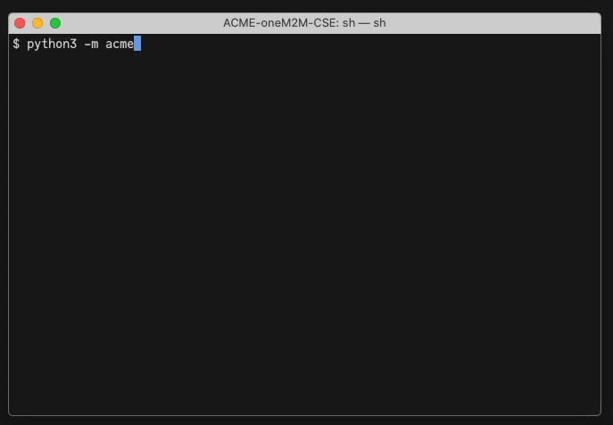

[← README](../README.md) 

# Installation

### Python

ACME requires **Python 3.8** or newer. Install it with your favorite package manager.

You may consider to use a virtual environment manager like pyenv + virtualenv (see, for example, [this tutorial](https://realpython.com/python-virtual-environments-a-primer/)).

## Installation and First Setup

1. Install the ACME CSE by cloning the repository, or by copying the whole distribution to a new directory.

		git clone https://github.com/ankraft/ACME-oneM2M-CSE.git
		cd ACME-oneM2M-CSE

1. **Either** install the above packages by running the following command (recommended):

		python3 -m pip install -r requirements.txt

	**OR** install them individually:  

		python3 -m pip install cbor2 flask InquirerPy isodate paho-mqtt plotext requests rich tinydb

1. Run the CSE for the first time.  
If no configuration file is found then an interactive configuration process is started. The
configuration is saved to a configuration file. e.g. *acme.ini* by default.  
&nbsp;  

1.  After terminating the CSE again you can edit that configuration file and add more settings if necessary.
	There are a lot of individual settings to configure here. Mostly, the defaults should be sufficient, but individual settings can be applied to each of the sections.  
	See the [Configuration](docs/Configuration.md) documentation for further details, and the defaults configuration file [acme.ini.default](../acme.ini.default).

## Running the CSE

Please refer to the [Running](Running.md) documentation for instructions how to start and run the ACME CSE next.

---
## Certificates and Support for https

To enable https you have to set various settings [\[server.http.security\] - HTTP Security Settings](Configuration.md#security_http), and provide a certificate and a key file. 
One way to generate those files is the [openssl](https://www.openssl.org) tool that may already be installed on your OS. The following example shows how to 
generate a self-signed certificate:

	openssl req -x509 -newkey rsa:4096 -keyout key.pem -out cert.pem -nodes -days 1000

This will generate the self-signed certificate and private key without password protection (*-nodes*), and stores them in the files *cert.pem* and *key.pem* respectively. 
*openssl* will prompt you with questions for *Country Name* etc, but you can just hit *Enter* and accept the defaults. The *-days* parameter affects the certificate's
expiration date.

Please also consult the *openssl* manual for further instructions. 

After you generated these files you can move them to a separate directory (for example you may create a new directory named *cert* in ACME's installation directory) and set the *caCertificateFile* and *caPrivateKeyFile* configuration parameters accordingly.

---

## Third-Party Components
The following third-party components are used by the ACME CSE.

### Core CSE
- The [cbor2](https://github.com/agronholm/cbor2) package is used to parse and create CBOR serializations. MIT License
- The CSE uses the [Flask](https://flask.palletsprojects.com/) web framework to service http(s) requests. BSD 3-Clause License
- [InquirerPy](https://github.com/kazhala/InquirerPy/) is a collection of common interactive command-line interfaces. MIT License
- The [isodate](https://github.com/gweis/isodate) package is used to parse and handle ISO 8601 time, date, and duration. BSD License
- The [paho-mqtt](https://www.eclipse.org/paho/) library provides a client class which enables applications to connect to an MQTT broker. Eclipse Public License 1.0 
- The [plotext](https://github.com/piccolomo/plotext) library offers functions to plot graphs in the text console. MIT License
- The CSE uses the [Requests](https://requests.readthedocs.io) HTTP Library to send requests vi http. Apache2 License
- The CSE uses the [Rich](https://github.com/willmcgugan/rich) text formatter library to format various terminal output. MIT License 
- To store resources the CSE uses the lightweight [TinyDB](https://github.com/msiemens/tinydb) document database. MIT License

### Web UI Components
- TreeJS: [https://github.com/m-thalmann/treejs](https://github.com/m-thalmann/treejs), MIT License
- Picnic CSS : [https://picnicss.com](https://picnicss.com), MIT License

[← README](../README.md) 
