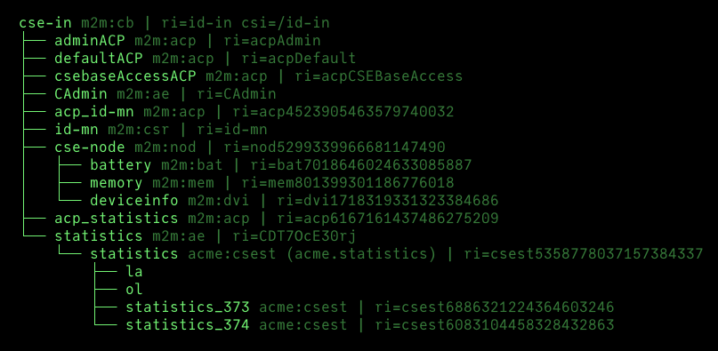

[← README](../README.md) 

# Running

## Installation and Configuration

Please refer to the [Installation](Installation.md) and [Configuration](Configuration.md) documentation for
installing the CSE and setting up the CSE's configuration. 

## Running the CSE

You can start the CSE by simply running it from a command line:

	python3 -m acme

In this case the [configuration file](Configuration.md) *acme.ini* configuration file must be in the same directory. An [interactive
configuration process](Installation.md#first_setup) is started if the configuration file is not found.

In additions, you can provide additional command line arguments that will override the respective settings from the configuration file:

| Command Line Argument                             | Description                                                                                                                                                     |
|:--------------------------------------------------|:----------------------------------------------------------------------------------------------------------------------------------------------------------------|
| -h, --help                                        | Show a help message and exit.                                                                                                                                   |
| --http, --https                                   | Run the CSE with http or https server. This overrides the [useTLS](Configuration.md#security) configuration setting.                                       |
| --config &lt;filename>                            | Specify a configuration file that is used instead of the default (*acme.ini*) one.                                                                              |
| --db-reset                                        | Reset and clear the database when starting the CSE.                                                                                                             |
| --db-storage {memory,disk}                        | Specify the DB\'s storage mode. This overrides the [inMemory](Configuration.md#database) configuration setting.                                            |
| --headless                                        | Operate the CSE in headless mode. This disables almost all screen output and also the build-in console interface.                                               |
| --http-address &lt;server URL>                    | Specify the CSE\'s http server URL. This overrides the [address](Configuration.md#http_server) configuration setting.                                      |
| --http-port &lt;http port>                        | Specify the CSE\'s http server port. This overrides the [address](Configuration.md#http_port) configuration setting.                                       |
| --import-directory &lt;directory>                 | Specify the import directory. This overrides the [resourcesPath](Configuration.md#general) configuration setting.                                          |
| --network-interface &lt;ip address                | Specify the network interface/IP address to bind to. This overrides the [listenIF](Configuration.md#server_http) configuration setting.                    |
| --log-level {info, error, warn, debug, off}       | Set the log level, or turn logging off. This overrides the [level](Configuration.md#logging) configuration setting.                                        |
| --mqtt, --no-mqtt                                 | Enable or disable the MQTT binding. This overrides MQTT's [enable](Configuration.md#client_mqtt) configuration setting.                                    |
| --remote-cse, --no-remote-cse                     | Enable or disable remote CSE connections and checking. This overrides the [enableRemoteCSE](Configuration.md#general) configuration setting.               |
| --statistics, --no-statistics                     | Enable or disable collecting CSE statistics. This overrides the [enable](Configuration.md#statistics) configuration setting.                               |

### Debug Mode

Please see [Development - Debug Mode](Development.md#debug-mode) how to enable the debug mode to see further information in case you run into problems when trying to run the CSE.

## Stopping the CSE

The CSE can be stopped by pressing pressing the uppercase *Q* key or *CTRL-C* **once** on the command line. [^1]

[^1]: You can configure this behavior with the [\[cse.console\].confirmQuit](Configuration.md#console) configuration setting.
 
Please note, that the shutdown might take a moment (e.g. gracefully terminating background processes, writing database caches, sending notifications etc). 

**Being impatient and hitting *CTRL-C* twice might lead to data corruption.**

## Command Console

The CSE has a command console interface to execute build-in commands. The following commands are available:

	┏━━━━━━━┳━━━━━━━━━━━━━━━━━━━━━━━━━━━━━━━━━━━━━━━━━━━━━━━━━━━━━━━━┳━━━━━━━━┓
	┃ Key   ┃ Description                                            ┃ Script ┃
	┡━━━━━━━╇━━━━━━━━━━━━━━━━━━━━━━━━━━━━━━━━━━━━━━━━━━━━━━━━━━━━━━━━╇━━━━━━━━┩
	│ h, ?  │ This help                                              │        │
	│ A     │ About                                                  │        │
	│ Q, ^C │ Shutdown CSE                                           │        │
	│ c     │ Show configuration                                     │        │
	│ C     │ Clear the console screen                               │        │
	│ D     │ Delete resource                                        │        │
	│ E     │ Export resource tree to *init* directory               │        │
	│ G     │ Plot graph (only for container)                        │        │
	│ ^G    │ Plot & refresh graph continuously (only for container) │        │
	│ i     │ Inspect resource                                       │        │
	│ I     │ Inspect resource and child resources                   │        │
	│ k     │ Catalog of scripts                                     │        │
	│ l     │ Toggle screen logging on/off                           │        │
	│ L     │ Toggle through log levels                              │        │
	│ r     │ Show CSE registrations                                 │        │
	│ s     │ Show statistics                                        │        │
	│ ^S    │ Show & refresh statistics continuously                 │        │
	│ t     │ Show resource tree                                     │        │
	│ T     │ Show child resource tree                               │        │
	│ ^T    │ Show & refresh resource tree continuously              │        │
	│ u     │ Open web UI                                            │        │
	│ w     │ Show workers status                                    │        │
	├───────┼────────────────────────────────────────────────────────┼────────┤
	│ Z     │ Reset and restart the CSE                              │   ✔︎    │
	└───────┴────────────────────────────────────────────────────────┴────────┘

[Script commands](ACMEScript.md) with configured [key binding](ACMEScript-metatags.md#meta_onkey) are shown in addition to
the build-in commands.

**Example**  
The CSE's resource tree can be shown by pressing the `t` key:

### Hiding Resources in the Console's Tree

Sometimes it could be useful in demonstrations if one would be able to hide resources from the console's resource tree.
That can be accomplished by listing these resources in the setting *[cse.console].hideResources*. 
Simple wildcards are allowed in this setting.

Example to hide all resources with resource identifiers starting with 'acp':

	[cse.console]
	hideResources=acp*

### Exporting Resources

One of the tasks the CSE performs during start-up is that it imports resources located in the *init* directory. 
This builds up an initial resource tree. See [Importing Resources](Importing.md#resources) for a more detailed description.

With the console command "E - Export resource tree to *init* directory" one can export the current state of the resource 
tree to the *init* directory as a [ACMEScript script](ACMEScript.md) so that it can be imported again automatically 
during the next CSE start-up, or reset. The structured resource path and the resource type are taken for the filename of the 
resources, and should be therefore easily identifiable.

Resource that have been imported this way are ignored in the export to avoid conflicts.

## Running a Notifications Server

If you want to work with subscriptions and notification then you might want to have a Notifications Server running first before starting the CSE. The Notification Server provided with the CSE in the [tools/notificationServer](../tools/notificationServer) directory provides a very simple implementation that receives and answers notification requests.

See the [Notification Server's README](../tools/notificationServer/README.md) file for further details.

[← README](../README.md) 
