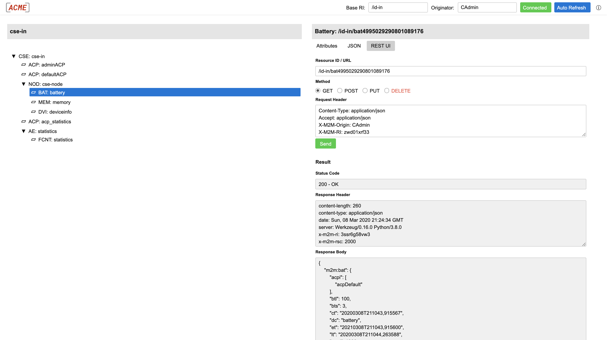

[← README](../README.md) 

# Web UI

The Web UI is by default enabled and reachable under the (configurable) web path *&lt;host>/webui*.

- To login you need to specify a valid originator. The default "admin" originator is *CAdmin*.
- Beside of the default *CSEBase* resource you can specify a different resource identifier as the root of the resource tree.
- You can navigate the resource tree with arrow keys.
- You can switch between short and long attribute names (press CTRL-H).
- The web UI communicates via the Mca interface over http or https with the CSE. It doesn't use any special API calls.


## REST UI

The web UI also provides a REST UI where you can send REST requests directed at resources on the CSE.



## Run the ACME Web UI as a Stand-Alone Application

The web UI can also be run as an independent application.  Since it communicates with the CSE via the Mca interfave it should be possible to use it with other CSE implementations as well as long as those third party CSEs follow the oneM2M http binding specification. It only supports the resource types that the ACME CSE supports, but at least it will present all other resource types as *unknown*.

You can start the stand-alone web UI in a terminal like this (in the sub-directory [acme/webui](../acme/webui):

```bash
python3 webUI.py
```

It starts with defaults, which can be set via command line arguments


| Command Line Argument             | Description                                                                                                                                                        |
|:----------------------------------|:-------------------------------------------------------------------------------------------------------------------------------------------------------------------|
| -h, --help                        | Show a help message and exit.                                                                                                                                      |
| --ip HOSTIP                       | Specify the web UI's local IP address to bind to. <br />Default: 127.0.0.1  (only localhost)                                                                       |
| --port HOSTPORT                   | Specify the web UI's local port. <br />Default: 8000                                                                                                               |
| --cseurl TARGETURL                | The target CSE's base URL. This is where the actual CSE can be reached.<br />Default: http://127.0.0.1:8080/                                                       |
| --ri TARGETRI                     | The target CSE's default base RI.<br />Default: id-in                                                                                                              |
| --originator TARGETORIGINATOR     | The target CSE's default originator.<br /> Default: CAdmin                                                                                                         |
| **https/tls**                     |                                                                                                                                                                    |
| --tls                             | Enable TLS (https) for the web UI.<br />It is disabled by default.                                                                                                 |
| --certfile CERTFILE               | Path to the certificate file for TLS.<br />Required for --tls.<br />Default: None.                                                                                 |
| --keyfile KEYFILE                 | Path to the private key file.<br />Required for --tls.<br />Default: None.                                                                                         |
| **OAuth**                         |                                                                                                                                                                    |
| --oauth                           | Enable OAuth2 authentication for CSE access.<br />Default: False.                                                                                                  |
| --oauth-server-url OAUTHSERVERURL | The OAuth2 server URL from which to retrieve the authentication token.<br />Default: None.<br />Automatic token retrieval and renewal is supported for *keycloak*. |
| --client-id CLIENTID              | The OAuth2 client ID.<br />Default: None.                                                                                                                          |
| --client-secret CLIENTSECRET      | The OAuth2 client secret.<br />Default: None.                                                                                                                      |
| **Misc**                          |                                                                                                                                                                    |
| --logging                         | Enable logging to console.<br />Default: False                                                                                                                     |
| --no-open                         | Disable opening a web browser on startup.<br /> Default: False                                                                                                    |


### Example
The following command starts the web UI's proxy server with the following parameters:

- The proxy binds to the local IP interface (127.0.0.1) on port *8000* (both the defaults).
- The proxy proxy serves the web UI via http (the default, no TLS is enabled).
- The remote CSE is reachable at *https://example.com/cse/* and has the resource ID *incse*.
- The remote CSE requires OAuth2 authentication, the client ID is *aClientID*, the client secret is *aClientSecret*, and the token is retrieved and renewed from *https://example.com/token*.
- Logging is enabled. 

&nbsp;

	python3 webUI.py --cseurl https://example.com/cse/ --logging --ri incse --oauth --client-id aClientID --client-secret aClientSecret --oauth-server-url https://example.com/token


[← README](../README.md) 