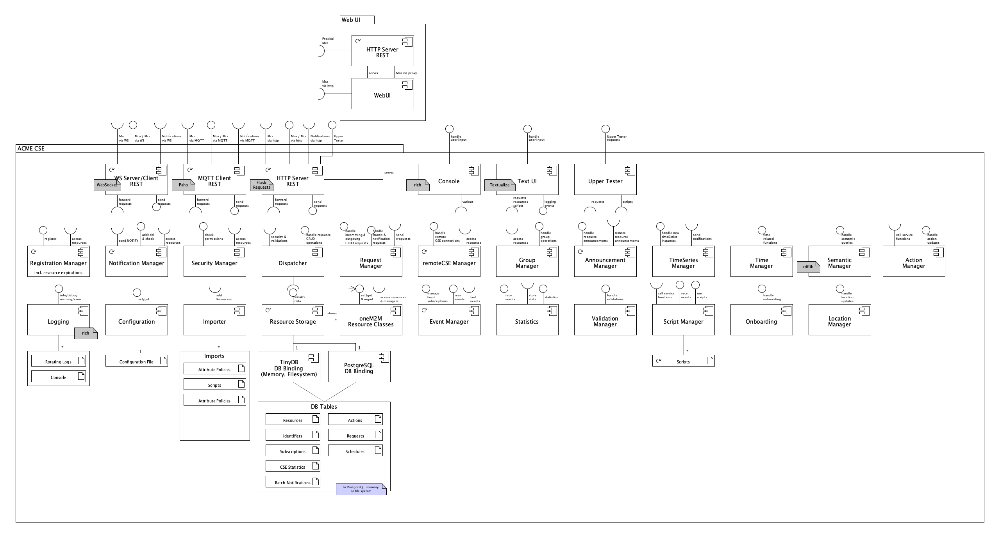
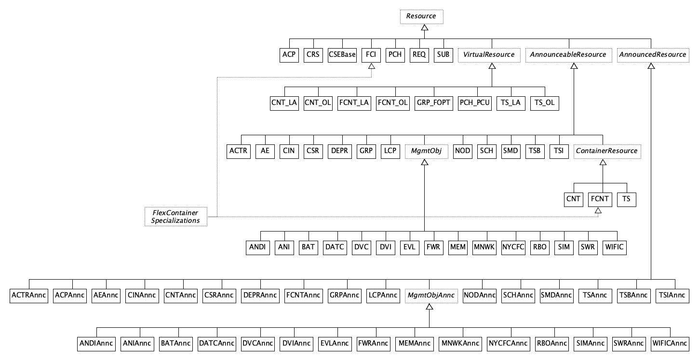

# Overview

This article provides an overview of the ACME CSE's architecture, components, and database schemas. 

TODO It also describes how to integrate the CSE into other applications and how to run it in a Jupyter Notebook.

## Components

The ACME CSE is divided into several components. The following diagram shows the components and their relationships.

<figure markdown="1">

<figcaption>UML Component Diagram of the ACME CSE</figcaption>
</figure>

## Resource Class Hierarchy

The CSE's resources are implemented as classes. The following diagram shows the class hierarchy of the resources.

<figure markdown="1">

<figcaption>UML Class Diagram of the ACME CSE Resources</figcaption>
</figcaption>
</figure>

## Database Schemas

<figure markdown="1">

<figcaption>Database Schemas of the ACME CSE</figcaption>
</figcaption>
</figure>

If not hold in memory the database files are stored in the ["data"](../data) sub-directory. 

The database used by the CSE is [TinyDB](https://github.com/msiemens/tinydb){target=_new} which uses plain JSON files for storing the data. Some files only contain a single data table while other contain multiple tables.

The filenames include the *CSE-ID* of the running CSE, so if multiple CSEs are running and are using the same data directory then they won't interfere with each other. The database files are copied to a *backup* directory at CSE startup.

Some database tables duplicate attributes from actual resources, e.g. in the *subscription* database. This is mainly done for optimization reasons in order to prevent a retrieval and instantiation of a full resource when only a few attributes are needed.


<mark>TODO move the following to a separate article "Integrating </mark>
<a name="integration"></a>
## Integration Into Other Applications

It is possible to integrate the CSE into other applications. In this case you would possibly like to provide startup arguments, for example the path of the configuration file or the logging level, directly instead of getting them from *argparse*.

You might want to get the example from the starter file [acme.py](acme.py) where you could replace the line:

```python
CSE.startup(parseArgs())
```

with a call to the CSE's *startup()* function:

```python
CSE.startup(None, configfile=defaultConfigFile, loglevel='error')
```

Please note that in case you provide the arguments directly the first argument needs to be `None`. 

The names of the *argparse* variables can be used here, and you may provide all or only some of the arguments. Please note that you need to keep or copy the `import` and `sys.path` statements at the top of that file.

### Jupyter Notebooks

Since ACME CSE is written in pure Python it can be run in a Jupyter Notebook. The following code could be copied to a notebook to run the CSE.

```python
# Increase the width of the notebook to accommodate the log output
from IPython.display import display, HTML
display(HTML("<style>.container { width:100% !important; }</style>"))

# Change to the CSE's directory and start the CSE
# Ignore the error from the %cd command
%cd -q tools/ACME   # adopt this to the location of the ACME CSE
%run -m acme -- --headless
```

- The CSE should be run in *headless* mode to avoid too much output to the notebook.
- Once executed the notebook cell will not finish its execution. It is therefore recommended to run the CSE in a separate notebook.
- The CSE can only be stopped by stopping or restarting the notebook's Python kernel.

<a name="unit_tests"></a>


<a name="mypy"></a>
## MyPy Static Type Checker

The CSE code is statically type-checked with [mypy](https://mypy-lang.org){target=_new}. 

Just execute the ```mypy``` command in the project's root directory. It will read its configuration from the configuration file [mypy.ini](../mypy.ini).


## Debug Mode

The CSE tries to catch errors and give helpful advice as much as possible during runtime.
However, there are circumstances when this could not done easily, e.g. during startup.

In order to provide additional information in these situations one can set the *ACME_DEBUG* environment variable (to any value):

	$ export ACME_DEBUG=1