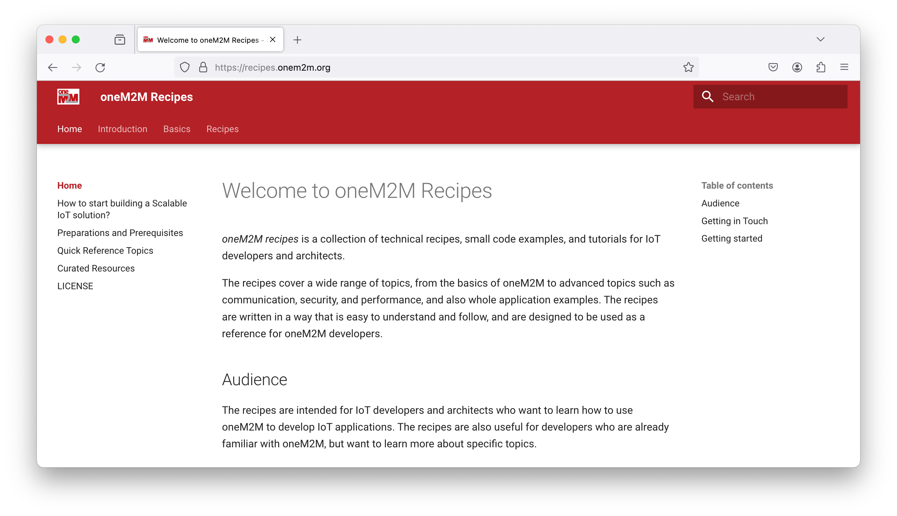

# oneM2M Recipes

The oneM2M website provides a collection of introductory articles and recipes that demonstrate how to use oneM2M. These recipes are designed to help you get started with oneM2M and to provide you with a better understanding of how to use oneM2M in your projects.

The recipes can be found on the oneM2M website at [https://recipes.onem2m.org](https://recipes.onem2m.org){target=_new}.

<figure markdown="1">
{target=_new}
<figcaption>oneM2M Recipes</figcaption>
</figure>