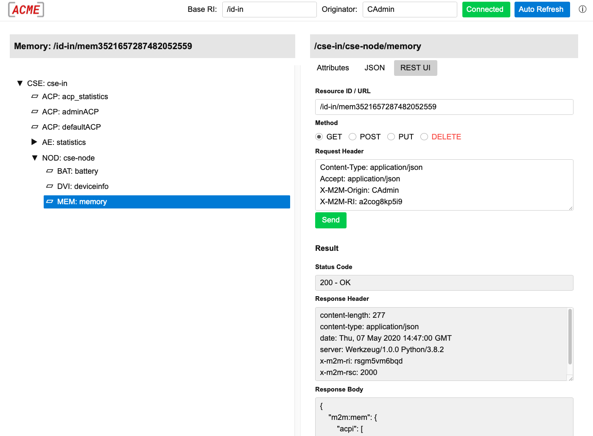

# Web UI

The Web UI by default is enabled and reachable under the (configurable) web path *&lt;host>/webui*.

- To login you need to specify a valid originator. The default "admin" originator is *CAdmin*.
- Beside of the default *CSEBase* resource you can specify a different resource identifier as the root of the resource tree.
- You can navigate the resource tree with arrow keys.
- You can switch between short and long attribute names (press CTRL-H).
- The web UI communicates via the Mca interface over http or https with the CSE. It doesn't use any special API calls.

## REST UI

The web UI also provides a REST UI where you can send REST requests directed at resources on the CSE.

<figure markdown="1">

<figcaption>ACME CSE Web UI with REST Interface</figcaption>
</figure>

